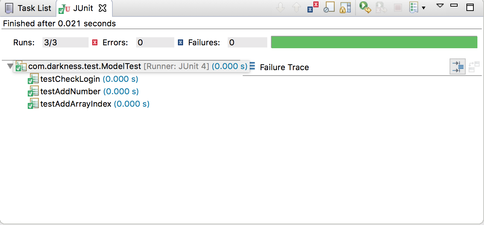

# JUnit-Test-Java

## JUnit là gì?
JUnit là một framework đơn giản dùng cho việc tạo các unit testing tự động, và chạy các test có thể lặp đi lặp lại. JUnit là một framework được dùng cho unit test trong Java.

Trong JUnit có các Test Case là các lớp của Java, các lớp này bao gồm một hay nhiều các phương thức cần kiểm tra, và Test Case này lại được nhóm với nhau để tạo thành Test Suite. Mỗi phương thức thử trong JUnit phải được thực thi nhanh chóng.

## Lợi ích của 
JUnit tránh cho người lập trình phải làm đi làm lại những việc kiểm thử nhàm chán bằng cách tách biệt mã kiểm thử ra khỏi mã chương trình, đồng thời tự động hóa việc tổ chức và thi hành các bộ số liệu kiểm thử.

## Annotation trong JUnit
Tên Annotation | Ý nghĩa
------------ | -------------
```@RunWith``` | Xác định **test runner**
```@Suite``` | Thực thi nhiều **test case** cùng một lúc
```@Before``` | Với annotation này thì method sẻ được thực thi trước mỗi method **test**. ```public void```
```@BeforeClass``` | Với annotation này thì method sẻ chỉ **chạy 1 lần** và **trước** tất cả method của class (EX: connect database). ```public static void```
```@After``` | Với annotation này thì method sẽ được thực thi sau mỗi phương thức **test**. ```public void```
```@AfterClass``` | Với annotation này thì method sẻ chỉ **chạy 1 lần** và **sau** tất cả method của class. ```public static void```
```@Test``` | Đánh dấu một method dùng để **test**.
```@Test(expected = ArithmeticException.class)``` | Bắt ngoại lệ cho method **test**
```@Test(timeout=time)``` | Xác định thời gian thực thi cho method **test**

Example:
```java
public class TestDemo {
	@Before
	public void before(){
		System.out.println("Before");
	}
	
	@After
	public void after(){
		System.out.println("After");
	}
	
	@Test
	public void test1(){
		System.out.println("Test 1 run");
	}
	
	@Test
	public void test2(){
		System.out.println("Test 2 run");
	}
	
	@BeforeClass
	public static void beforeClass(){
		System.out.println("BeforeClass");
	}
	
	@AfterClass
	public static void afterClass(){
		System.out.println("AfterClass");
	}
}

```

Console
```
BeforeClass
Before
Test 1 run
After
Before
Test 2 run
After
AfterClass
```


## Các method trong JUnit
Các method dạng **assertXXX()** có trong lớp **junit.framework.Assert**.

Tên method | Ý nghĩa
------------ | -------------
```void assertEquals(object expected, object actual)``` | So sánh 2 giá trị để kiểm tra bằng nhau. Test sẽ được chấp nhận nếu các giá trị bằng nhau.
```void assertFalse(boolean condition)``` | Đánh giá biểu thức logic. Test sẽ được chấp nhận nếu biểu thức sai.
```void assertNotNull(Object object)``` | So sánh tham chiếu của một đối tượng với null. Test sẽ được chấp nhận nếu tham chiếu đối tượng khác null.
```void assertNull(Object object)``` | So sánh tham chiếu của một đối tượng với giá trị null. Test sẽ được chấp nhận nếu tham chiếu là null.
```void assertTrue(boolean condition)``` | Đánh giá biểu thức logic. Test sẽ được chấp nhận nếu biểu thức đúng
```void assertSame(boolean condition)``` | So sánh địa chỉ vùng nhớ của 2 tham chiếu đối tượng bằng cách sử dụng toán tử ==. Test sẽ được chấp nhận nếu cả 2 đều tham chiếu đến cùng một đối tượng.
```void assertNotSame(boolean condition)``` | So sánh địa chỉ vùng nhớ của 2 tham chiếu đối tượng bằng cách sử dụng toán tử ==. Test sẽ được chấp nhận nếu cả 2 đều tham chiếu đến các đối tượng khác nhau
```void assertArrayEquals(expectedArray, resultArray)``` | So sánh 2 mảng để kiểm tra bằng nhau. Test sẽ được chấp nhận nếu các giá trị bằng nhau.
```void fail()``` | Method này làm cho test hiện tại thất bại, method này thường được sử dụng khi xử lý các ngoại lệ.

Example:
Class Model gồm những method để thực hiện unit test.
```java
public class Model {
	public int addNumber(int a, int b) {
		return a + b;
	}

	public boolean checkLogin(String username, String password) {
		boolean check = false;
		if ("darkness".equals(username) && "123456".equals(password))
			check = true;
		return check;
	}

	public int[] addArrayIndex(int[] arr) {
		int[] newArray = new int[arr.length];

		for (int i = 0; i < arr.length; i++) {
			newArray[i] = arr[i] + 2;
		}

		return newArray;
	}
}
```

Tiếp theo tạo 1 **JUnit Test Case** có tên **ModelTest**. Tại **Model Test** ta sẻ sử dụng các annotation của JUnit cung cấp để viết các method sử dụng cho việc test các method trong class Model.

```java
public class ModelTest {

	private Model mModel;

	@Before
	public void setUp() {
		mModel = new Model();
	}

	@Test
	public void testAddNumber() {
		int expectedValue = 5;
		int actualValue = mModel.addNumber(2, 3);
		assertEquals(expectedValue, actualValue);
	}

	@Test
	public void testCheckLogin() {
		boolean expectedValue = true;
		boolean actualValue = mModel.checkLogin("darkness", "123456");

		assertEquals(expectedValue, actualValue);

		assertTrue(mModel.checkLogin("darkness", "123456"));
		assertFalse(mModel.checkLogin("nguyenvantra", "abcabc"));
	}

	@Test
	public void testAddArrayIndex() {
		int[] arr = { 1, 2, 3, 4 };

		int[] expectedArrayValue = { 3, 4, 5, 6 };
		int[] actualArrayValue = mModel.addArrayIndex(arr);

		assertArrayEquals(expectedArrayValue, actualArrayValue);
	}

}
```

Kết quả thu được:


## Bắt ngoại lệ cho method test
Chuyện gì xảy ra khi chúng ta test method **addArrayIndex** như thế này:
```java
@Test
public void testAddArrayIndex() {
	int[] arr = null;

	int[] expectedArrayValue = { 3, 4, 5, 6 };
	int[] actualArrayValue = mModel.addArrayIndex(arr);

	assertArrayEquals(expectedArrayValue, actualArrayValue);
}
```
Khi run test thì Eclipse sẻ thông báo lỗi với tên là **java.lang.NullPointerException** để khắc phục những ngoại lệ xảy ra khi viết test chúng ta có thể làm như sau.
```java
@Test(expected = NullPointerException.class)
public void testAddArrayIndex() {
	int[] arr = null;

	int[] expectedArrayValue = { 3, 4, 5, 6 };
	int[] actualArrayValue = mModel.addArrayIndex(arr);

	assertArrayEquals(expectedArrayValue, actualArrayValue);
}
```

## JUnit test suites
Nếu bạn có nhiều **class test**, bạn có thể kết hợp chúng thành **test suite**(bộ kiểm tra).
Một **test suites** có thể chứa **1 test suite** khác.

```java
@SuiteClasses({
	FirstClassTest.class,
	SecondClassTest.class
})
public class AllTests {
	//do something test
}
```

## Parameterized test 


